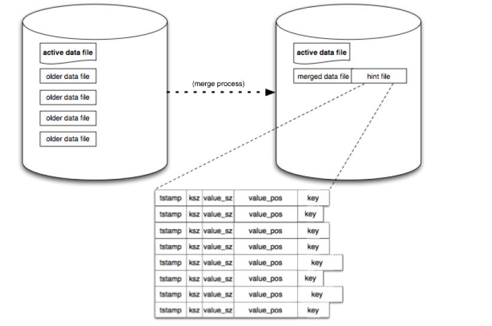

- main.java is currently a testclass for bitcask 
### output :


- Example structure of the project
``` 
demo/
  pom.xml
  src/main/java/
    bitcask/
      BitCask.java      ✓  but to modified yet too with compaction and hintfile
      KeyDir.java       ✓
      Segment.java      ✓
      HintFile.java     X
      Compactor.java    X
    kafka/
      WeatherConsumer.java
      RainProcessor.java
    parquet/
      ParquetWriter.java
    api/
      BitCaskController.java   ← REST endpoints for the client script
```

### the bitcask access methods :
* get(key) -> gets the value of given key (should return latest value of key (station))
* put(key,value,timestamp) -> creates a record with the data and insert it in the segment
* getAll() -> to get *all* stations latest value

# According to Bitcask paper

## Hintfiles:

### content:

They're structured almost identically to the regular data files, but with one key difference:
instead of storing the actual values, they store the position and size of where each value lives within the corresponding data file.
So a hint file entry has fields like `tstamp|ksz|value_sz|value_pos|key` - but no value itself.

The reason:
When a Bitcask instance is opened, it needs to reconstruct the in-memory keydir (the hash table mapping every key to its file location).
Without hint files, it would have to scan through every data file entirely to rebuild this structure, which is slow. With hint files, it can scan those instead, they're much smaller since they omit all the value data, making startup significantly faster.

if no hint file is found for a data file:
The reconstruction scans all of the data files in the directory in order to build a new keydir.
This means it reads through every single data file entry by entry - going through the full `crc | tstamp | ksz | value_sz | key | value records` - just to extract the key locations.
This also works but is significantly slower since it's reading through all the value bytes too, even though it doesn't need them for rebuilding the keydir, hence the purpose for hint files for fast recovery.


### Note:
hint files are not a snapshot of the keydir saved on close. They are tied specifically to the merge process. Here's the distinction:

The merge process takes multiple older immutable data files and compacts them into a new merged data file per segment
A hint file is created alongside each output merged data file, acting as its pre-built index
The active data file (the one currently being written to) never has a hint file — it hasn't been through a merge yet

So on startup, Bitcask handles files in two different ways:
1) Merged segments → use their hint file for fast keydir reconstruction
2) The active file (and any unmerged segments) → must be scanned directly - hence why on close , the active segment must be "marked as full" even though its not to seal it - save it - merge it and create hint-file for it 


for timestamp in the record saved in the logs we can 
1) use system.currentTimeMillis() , but it may cause problems if 2 records are issued exactly at the same milli time
  -> i think its unneccessary for this project, as stations weathers won't change per milli seconds

2) use system.nanoTime() resolved the conflict problem but has meaning if read by human


3) can keep timestamp saved by millis and add another field in the record for a sequence number just for ordering to ensure the actual lastest record, away from the conflist that may happen in milli seconds

``` java
public class Record {
    private String key;
    private String Value;
    private long timestamp;
    private final long sequence;  // monotonic counter - for ordering
}   

// then changes applied my be 
// in BitcaskServer
private final AtomicLong sequenceNumber = new AtomicLong(0);

// then in BitcaskServer put()
long timestamp = sequenceNumber.incrementAndGet();
Record record = new Record(key, value, timestamp);
    
```

Design Decisions are 
1) the scheduler compaction each how much time ?
2) the max segment size then remarked full = ?
3) hint files save what data for optimized saving and retreiving
4) when to save - fsync files , after each write OR at closing the server -aka- closing the segment?

1. in the code it is implemented to run for the first time after only 1 minute , then periodically after each 3 minutes

  I did that because for the very first run we need compaction fast <---- just to create a fast hint file 
  and periodically after each 3 minutes to leave a margin for the merge(compaction) + hint files creation to finish

2. the maximum segment size for now is 64MB <--- no real reason why, but it must be not too big for fast merge and hint creation , yet not too small to prevent the segment + .data file creation overhead

3. hint files save the content described at the paper, mainly removing the actual value only comparing to data-files. to avoid the heavy load of reading/skipping the value too even though, its not needed in reconstructing the keydir index map


### Note:
Hint files are saved ONLY after the completion of the merge process 
meaning:
after the merge process finishes and successfully generate a merged.data file, createHint is calles to create merged.hint
and this is the only place and why the hint files are created

Also, after the hint files are successully created , older ".data" segment are deleted (merged and previously active segment), so the only data files that exist in the directory are the activeSegment.data and the latest merged.data

finally, the older .hint files are also deleted for saving space


Then at reloading, reload the merged.hint file, if any .data file exist that has no .hint file , also reload it 
that means that either the merged.data segment hasn't completed the .hint file creation process
or program was closed before the activeSegment was also sealed and merged.
Summary: that means that the .data files are the last run activeSegment and merged.data files with no/corrupted .hint files


4) fsync for forcing syncing/flushing the files saved on the os cache - memory on the disk
  for the implementation : this is done at only 2 places
  1. at closing the server at - bitcask.close()
  2. at saving the new mergedSegment -> it can be also delegated to the end , however i kept it as it is to combine speed(no fsync at each put) with durability (ensuring the disk files contain the data).
