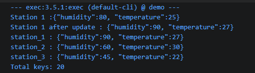

- main.java is currently a testclass for bitcask 
### output :


- Example structure of the project
``` 
demo/
  pom.xml
  src/main/java/
    bitcask/
      BitCask.java      ✓  but to modified yet too with compaction and hintfile
      KeyDir.java       ✓
      Segment.java      ✓
      HintFile.java     X
      Compactor.java    X
    kafka/
      WeatherConsumer.java
      RainProcessor.java
    parquet/
      ParquetWriter.java
    api/
      BitCaskController.java   ← REST endpoints for the client script
```

### the bitcask access methods :
* get(key) -> gets the value of given key (should return latest value of key (station))
* put(key,value,timestamp) -> creates a record with the data and insert it in the segment
* getAll() -> to get *all* stations latest value